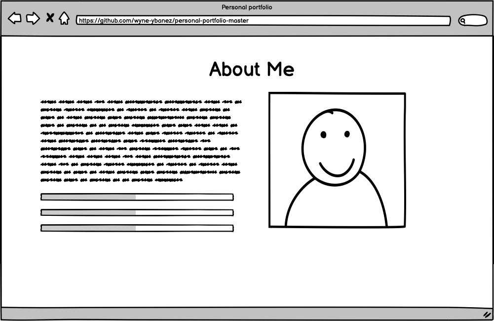
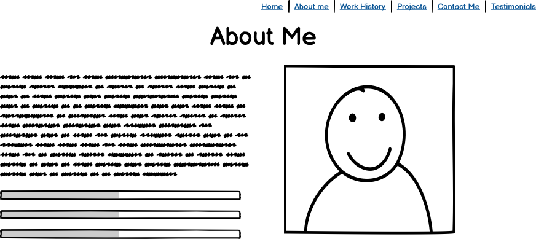
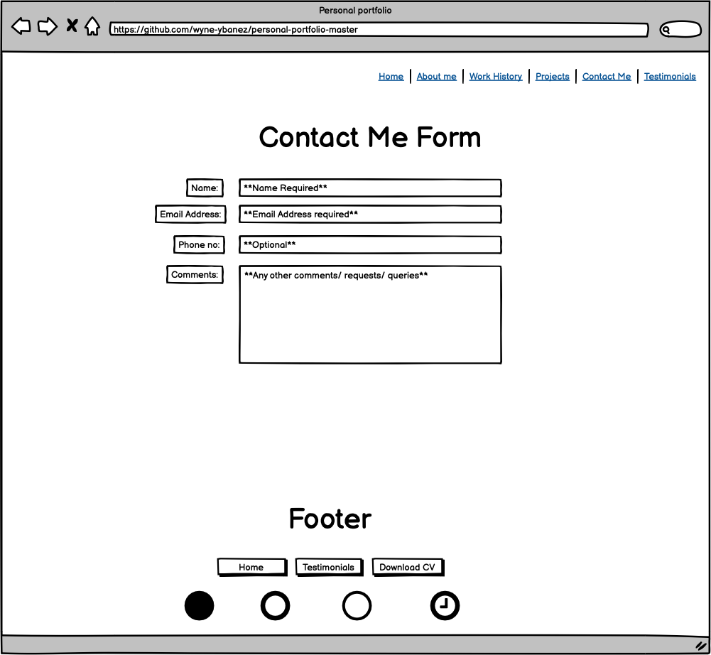

# Code Institute MS1: Personal Portfolio Project

[View the live project here.]()

## Project Goal

This project aims to portray a junior software developer in the best light personally, technically and professionally. It should show the personality of the person, what skills and experience they have obtained throughtout their professional life as a developer. The project ultimately intends to pitch the junior developer as an asset to hiring businesses/companies. 

## UX 

The website should allow it's users to automatically identify the reason for why the website was created. In this case, the website is created to appeal to users, recruiters and hiring managers.

- As a recruiter I will have had worked through many resumes in order to find the right candidate. I would want a resume or website resume that can catch my attention from the get and maintain it. 
  
- As a user I would appreciate a website that would be easy to navigate. 

- As a user I would also prefer if the website can communicate the reasoning for its creation from the first instance of perceiving it.

- All interactions and buttons should be responsive, whether I am viewing the website from a mobile phone or hovering over the buttons with a cursor. There should be a indication to confirm what I am doing.

 

## Design

### Colour Scheme 
- The overall projec will have a black background.
- The two main contrasting colours for the project is blue green and blue with white texts.

### Fonts 
- Montserrat is the font used for the body, it looks clean and professional.
- Roboto is the secondary font - used mainly for headings.

### Opening the website: 

- The website should be consistent and objective. It should avoid straying away from promoting the candidate, this may create confusion. 

- The website's main page must navigate to relevant information, either by scrolling up and down or using the navigation links in the navbar. 
  
- As a user or recruiter would like to know about the candidate, their personality/ their experience and skills. This should be on the website & users should be able to find this quickly and easily.

### About Me:

- This section of the page will have a call to action buttons, mainly to project.html and contactme.html. 
  
- Should at any point the user feels that they would like to see my projects or contact me. This shortcut shall be provided. 

### Work History Timeline: 

 

 

### Transparent Sticky-Navbar: 

- Navigation Bar Code mainly deriving from Bootstrap. 

- If at any point the user should find themselves lost whilst navigating the website, they should be able to return to the home page or to the page they would like to view easily. 

- Users should be able to traverse to any section of the website at any point in time.

- At no point should the navbar distract the user from the information provided on the candidate's website. Hence, it should be transparent.

 

### Contact Form: 

- It would be efficient if there was a way for users to contact the candidate at any point of whilst traversing their website.

- This feature will require the user to input their contact details. Namely, the email address and name. If the candidate should ever respond, he/she will then know where/who the response is going to. 
  
- This will go into a separate html page.

 

### Projects: 

- This section of the website will be implemented through a separate html page.
  
- It will display 5 projects. The projects will for the mean time link to external third-party websites however, in future I will link my other completed projects to this section.

- It will consist of 5 projects supported by descriptive text at the side.

### Footer:

- When reaching the end point of the website, there may be a further queries users would like to ask the candidate. The 'contact me' feature should be present in preparation for this.

- The footer should have the relevant social links and buttons. These can help users/recruiters to research candidate further to discover more about them. 

- If users would like to read back over information in the previous sections. The footer should allow me to return to the relevant pages ie. Home page.

 

## Features

### Responsive: 

- The website should be responsive and confirm all interactions. 

- There should be some sort of indicator or animation that can confirm whenever the user is hovering over a button or clicking on it when using a computer or desktop.

- It should shrink it's windows and align items correctly when the user is minimzing the window or using a mobile phone. 
  
 

### Interactive: 

- The user should be able to interact with the website and function according to the given text
- I.E. Clicking on 'Contact Me' should bring the user to 'contact.html'
  
 
  
## Changes 
- (Banner Section) First I began to use the banner image of my profile picture however, I opted instead for the picture of the aurora borealis. 

- (About Section) Originally there was a wireframe for a progresion bar feature in the 'About me' section. I decided to remove the progression bar feature.

- This was the perfect blend of light blue, blue, white and dark which complimented each other to form a beautiful spectacle. I then used this overall theme for the website.

- (testimonial.html) I initially wanted to create a 'testimonial.html' and place the projects.html inside the main body of index.html. The testimonials have instead moved to index.html above the footer.

- I was planning to convey his via a carousel feature. I opted instead to create projects.html as a separate file, replacing the testimonial.html idea. I thought the projects would clutter the main page and make it too long.

 

## Technologies used:

### Languages
-  [HTML5](https://en.wikipedia.org/wiki/HTML5)
-  [CSS3](https://en.wikipedia.org/wiki/Cascading_Style_Sheets)
  
### IDE
- [VScode:](https://code.visualstudio.com/) - The IDE used to code the website. 
- VSCode extension: [LiveServer](https://marketplace.visualstudio.com/items?itemName=ritwickdey.LiveServer)

### Frameworks, Libraries, CDN's
1. [AOS:](https://michalsnik.github.io/aos/) 
    - This JS library was used for the animations on scroll.
2. [HVR:](https://github.com/IanLunn/Hover/blob/master/css/hover.css)
    - This library was used for the hover effects of the navbar items.
3. [Bootstrapv4.5.3:](https://getbootstrap.com/) 
    - Bootstrap was used for the overall design and responsiveness of the website.
4. [Balsamiq:](https://balsamiq.com/)
    - Balsamiq was used to create the wireframes during the design process.
5. [GitHub:](https://github.com/)
    - GitHub is used to store the projects code after being pushed from Git.
6. [Git](https://git-scm.com/)
    - Git was used for version control by utilizing the Gitpod terminal to commit to Git and Push to GitHub.
7. [Font Awesome:](https://fontawesome.com/)
    - Font Awesome was used on all pages throughout the website to add icons for aesthetic and UX purposes.
8. [Google Fonts:](https://fonts.google.com/)
    - Google fonts were used to import 'Roboto' and 'Montserrat' as the chosen styled fonts for the site.
  
 

## Deployment

## Credits
1. Using these website's content for project.html
- https://blog.hubspot.com/marketing/best-website-designs-list
## Content 
(written content like wikipedia)
## Media 
(Where the photos were obtained from)
### Acknowledgements

I received Inspiration for the social icons within the Banner section from Code Insitute Student David O' Shea <<https://www.grahamsweeney.ie/>> 
(I received inspiration of this project from)

