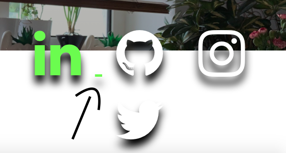
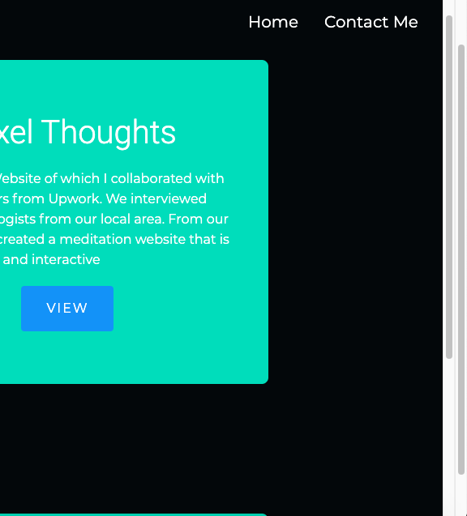

# Tests 

Tests are carried out first on the largest screen size and then updated regularly for smaller screens.

The W3CSchools and W3C CSS validator sevices were used to test for the overall syntax of the html and css pages.

## Main Bugs Previously Found: 

## Navigation Bar: 
  1. Hover over navigation bar with cursor
  2. Check to see if the toggler works on mobile screens
  3. Ensure that the navbar is semi-transparent at the start of the main page and becomes transparent as you scroll down 
  4. Check if Navbar stays sticky past the header 
  5. Check to see if the links work and bring you to the right sections/html files
  6. Check to see if the navbar toggler/hamburger is visible
   
### Navbar Comments:

- Instead of coloring the navbar toggler to become visible, I instead used an icon from font awesome to show represent it and colored it.
- Bug encountered where Navbar would stay sticky only until the header section has finished.

### Navbar Debug: 

- Fixed non-sticky bug using W3schools code: https://www.w3schools.com/howto/howto_js_navbar_sticky.asp 

## Hero Section: 

1. Check to see if AOS animations are working
2. Check to see if social links work 
3. Check if there is a small underline after the social icons
4. Check if the image is being shrunk when on mobile
   
### Hero Section Comments: 

- When hovering over social icons, there is a bug where there is a small underline next to the icons. 

### Hero Section Debug
- Annoying underline has been debugged using the following css: 
  
 `.social-icons a {
    text-decoration: none;
} `

- The Captions are positioned akwardly on smaller screens - media queries have been created to style them accordingly.

## Double Scroll Bar Bug 

projects.html bug discovered. The page has 2 scroll bars which is inconvenient for the user and overall looks unprofessional. 

1. Check if overflow-x and overflow-y is visible or hidden in style.css 
2. Adjust width and heights of container/content to a shorter amount - see if overflow will change/disappear.
3. Check to see if index.html page is encountering the same bug

 

### Double Scroll Bar Debug

- Forgot to type in closing section tag 
- '/section'

## Options Section:

1. Check if the same styles apply to the options in all index.html, contactme.html and projects.html
2. Check if the option buttons are evenly spaced and aligned
3. Check if options flex in a column when on mobile
4. Check if AOS animation functions properly 

### Options Section Comments: 

- Bug found where the options buttons were not styled correctly on mobile phone
- They appeared differently on chrome developer tools and on my personal mobile phone (iPhone xr)
- Bug found in contactme.html and projects.html where the background of the options section was dark and not inheriting the background of the section

### Options Section Debug: 

- Options section classes created specifically for projects.html and contactme.html
- These classes directly helped influence the styling of the options section
- Removed dark background by styling the div of these classes 
- background now inherits the main section background
- margins styled to center the option buttons 
- "btn" class and "button" type removed from options styling to fix appearance during external testing on my personal iPhone XR.

## Testing User Stories from UX 

### First Time Visitors: 

a. I would like to know the purpose for the creation of the website from the first instance of opening it. 
  - When the user opens the website there is an animation that shows what the website is about, which gives a caption of the candidate's name and his occupation.
  
b. I would greatly appreciate it if the website were easy to navigate.
  - The navigation bar is sticky so no matter where the user scrolls it will always be present to help them navigate to their desired content.

c. I expect the website to display relevant content and stay consistently relevant as I explore the site.
  - The website aims to display the necessary content that the user will expect to know and will continue to add relevant content to what has already been shared. e.g. At first the user will encounter the caption showing this website was created by a junior developer and next it shows them the 'about me' section outlining the technologies the candidate is using.
  
d. I would appreciate it if my interactions with the site were acknowledged so that I know what I am doing and where I am going.
  - There are hover animations and animations on scrolling throughout the website, these are used to help the user locate their position in the website and where their cursor is pointed 

e. I would like the content to be structured and easy to follow.
  - The website adopts a full page per section ethos. When the user scrolls, it will lead to content which aims to enhance the candidates potential. 
  - It does this by showing complimentary information about the candidate. These are divided into sections. This makes the info. easy to digest. This ultimately adds to the previous information that was shared.

### Returning Visitors: 

a. I would like to see in-depth information to the website with regards to how the candidate is improving in his ability to code. 
  - The website will be continuously updated as the candidate's skill increases. The 'about me ' section and the 'projects' section shows the the candidate's coding current and future ability.

b. I would like to see if the candidate has completed any coding experience with other businesses.
  - If a business wishes to display the candidate's work, they may give permission to have it established as a project in the candidate's projects.html. 
  - The testimonial section of index.html will also help with this.

c. I would like to it if there were a way to contact the candidate and find out more information.
  - There is a 'contact me' button in the navigation bar.
  - There is a 'contact me' in the options section at the end of the page.

### Frequent Visitor Goals:

a. I would like to check if the candidate is working on any projects.
  - 'projects.html' is constantly updated and will show any newly finished projects.
  - There is a github icon in the footer and the social icons in the hero section which leads to the candidates github page.

b. I want to be able to contact the candidate quickly.
  - The 'contact me' button in the navigation bar which will lead to the contact form where the user can message the candidate about current projects.
  - There is a contact button placed in the 'About me' section.
  - At the end of every HTML page, the contact button is always present at the end of the page.

c. I want to be able to navigate to any section of the website in order to read it in more detail.
  - The navigation bar is sticky, the user will be able to access this and press the appropriate button to travel to the desired section/page.
  - There are additional buttons at the end of every page which gives the user the option to return to the top of the page or check the candidate's projects or to contact the candidate. These pages were created to help the user discover more about the candidate.

### Further Testing

-   The Website was tested on Google Chrome, Firefox, Microsoft Edge and Safari browsers.
-   The Website was viewed on the specified testing devices such as Desktop, Laptop, iPad, iPhone7, iPhone 8, iPhone X using Chrome Developer Tools.
-   Links were tested repeatedly.
-   Friends and family members were asked to review the website, its content and the user experience overall.
-   Code Institute students were asked to review the website and any coding errors.

